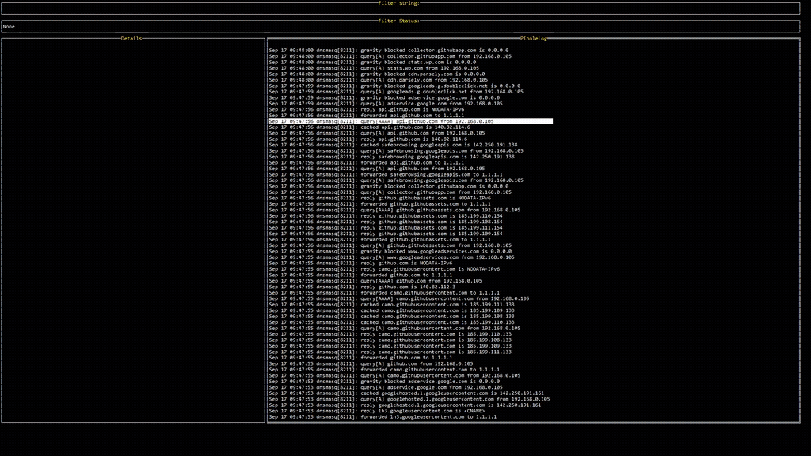

# Pihole Log Explorer

A Go TUI for exploring `/var/log/pihole.log` built using [tview](https://github.com/rivo/tview).

Current functionality:
* Search for arbitrary strings in log file
* Filter for certain types of queries
* Filter by the upstream DNS provider, IP address of the requester, and the IP address returned

